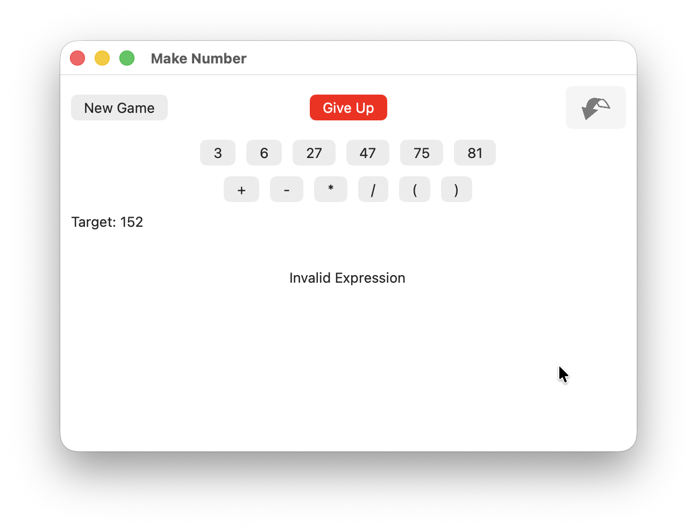

## Make Number

**The deployment facilities of this project is provided by** [Briefcase](https://briefcase.readthedocs.io/) **- part of**
[The BeeWare Project](https://beeware.org/). **If you want to see more tools like Briefcase, please
consider** [becoming a financial member of BeeWare](https://beeware.org/membership/).

> DISCLAIMER:  I am not affiliated with BeeWare, however it would still be nice to donate, as they're a small team maintaining a big and technically sophisticated project.

A game where numbers are provided from which to use +, -, *, /, and parenthesis to make other numbers from.

